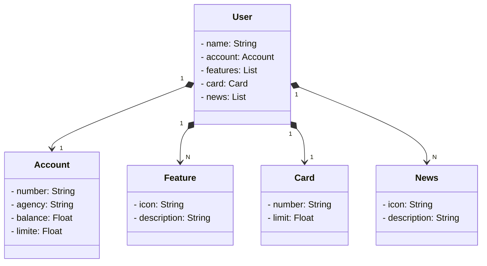

# Santander DEV Week 2023
Java RESTful API criada para Santander Dev Week 2023

## Diagrama de classe

```mermaid
classDiagram
  class User {
    - name: String
    - account: Account
    - features: List<Feature>
    - card: Card
    - news: List<News>
  }
  class Account {
    - number: String
    - agency: String
    - balance: Float
    - limite: Float
  }
  class Feature {
    - icon: String
    - description: String
  }
  class Card {
    - number: String
    - limit: Float
  }
  class News {
    - icon: String
    - description: String
  }

  User "1" *--> "1" Account
  User "1" *--> "N" Feature
  User "1" *--> "1" Card
  User "1" *--> "N" News
```

